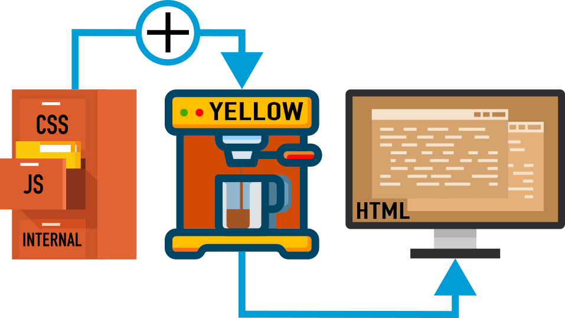

<p align="right"><a href="README.md">English</a> &nbsp; <a href="README-de.md">Deutsch</a></p>

# Addtopage

Füge CSS- oder JavaScript-Dateien oder Metadaten in [Yellow](https://datenstrom.se/yellow/)-Webseiten ein.

<p align="center"></p>	

## Wie installiere ich die Erweiterung?

[Downloade die ZIP-Datei](https://github.com/unknown/main.zip) und kopiere sie in das Verzeichnis `system/extensions` auf dem Server. [Lerne mehr über Erweiterungen](https://datenstrom.se/de/yellow/extensions/).

## Gesamtbeispiel

Fügt JavaScript und Metadaten in all deine Weibseiten ein. Erzeuge eine `<theme>.addtopage` Datei im Themen-Verzeichnis auf dem Server.

Angenommen das Thema ist `stockholm`, dann schreibe die Datei **`stockholm.addtopage`** in das Themen-Verzeichnis `system/themes`

Kopiere die zusätzliche JavaScript-Datei in die von dir erzeugten Unterverzeichnisse im Downloadverzeichnis `media/downloads`

Übersicht über die Order- / Dateistruktur:

```
├── media
|   └── downloads
|       └── js
|           └── darkmode
|               └── darkmode.js    = Füge diese Datei auf allen Seiten ein.
└── system
    └── themes
        └── stockholm.addtopage    = Enthält die Addtopage Anweisungen.
```

In `stockholm.addtopage` steht:

```
PAGE - footer
JS js/darkmode/darkmode.js footer
```

Die Metadaten (JavaScript-Code) der jeweiligen Seite werden dann auf jeder Seite eingefügt. Ebenso, wie die JavaScript-Datei  `js/darkmode/darkmode.js` 

Die Details hierzu stehen in den nächsten Kapiteln.

## Wie füge ich CSS- oder JavaScript-Dateien ein?

Es gibt drei Varianten CSS oder Javascript einzufügen.

Methode **(1)** und **(2)** machen dies nur auf einer Webseite. Methode **(3)** macht dies bei allen Webseiten.

### (1) Füge ein `[addtopage]` Shortcut hinzu

Für CSS und JavaScript sind folgende Argumente möglich, das letzte ist optinal.

`[addtopage Type File Options]`

`Type` = Dateityp: `CSS`, `STYLE`, `JAVASCRIPT` or `JS`

`File` = Dateiname oder Dateipfad mit oder ohne führendes `/`

`Options` = Optionale Optionen: `footer`, `inline`, `debug`  (  mehrere getrennt durch `:`    Bsp.   `footer:inline`  )

Die Dateien müssen im Serverordner `media/downloads` platziert werden.

[^1]: Falls nicht die Variable `CoreDownloadLocation` in der Hauptkonfigurationsdatei `system/extensions/yellow-system.ini` geändert wird.

​     Siehe: [Yellow Folder Structure](https://datenstrom.se/de/yellow/help/api-for-developers#verzeichnisstruktur)

```
├── content               = Webseiteninhalt
├── media                 = Mediendateinen
│   └── downloads         = Dateien für den Download
└── system                = Systemdateien
```

Die Typen `CSS` und `STYLE` sind synonym. Ebenso die Typen `JS` und `JAVASCRIPT`.

#### Beispiel für (1)

Füge den Shortcode auf einer Seite ein: **`[addtopage JS js/darkmode/darkmode.js footer]`**

```
└── media
    └── downloads
        └── js
            └── darkmode
                └── darkmode.js    = Datei, die in die Webseite eingefügt wird.
```

Die Datei wird in den Fußbereich der Webseite eingefügt (Ergebnis-HTML-Code):

```
...
<script type="text/javascript" src="/media/downloads/js/darkmode/darkmode.js"></script>
</body>
</html>
```

Wird die `footer` Option weggelassen, wird die Datei im HTML-Kopf eingefügt:

```
...
<meta name="generator" content="Datenstrom Yellow" />
<meta name="viewport" content="width=device-width, initial-scale=1" />
<script type="text/javascript" src="/media/downloads/js/darkmode/darkmode.js"></script>
...
```

### (2) Füge Addtopage in die Seiten-Einstellungen ein

Siehe: [Wie man das System ändert / Kapitel: Seiteneinstellungen](https://datenstrom.se/de/yellow/help/how-to-change-the-system#seiteneinstellungen)

Für CSS und JavaScript sind die folgenden Argumente anzugeben, die Optionen sind optional.

Füge den Seiten-Einstellungen hinzu: `Addtopage: Type File Options`

#### Beispiel für (2)

```
---
Title: Example page
Addtopage: JS js/darkmode/darkmode.js footer
---

This is an example page setting with file injection.
```

##### Bei der Angabe von mehreren Dateien in den Seiten-Einstellungen sind diese durch `|` zu trennen.

Beispiel:

```
---
Title: Example page
Addtopage: CSS css/injected-style.css | JS js/darkmode/darkmode.js footer
---

This is an example page setting with multiple file or meta data injection.
```

Die Ordnerstruktur für dieses Beispiel:

```
├── media
    └── downloads
        ├── css
        │   └── injected-style.css    = Datei, die als erste eingefügt wird.
        └── js
            └── darkmode
                └── darkmode.js       = Datei, die als zweites eingefügt wird.
```

### (3) Alle Seiten: Hinzufügen von CSS- und JavaScript-Dateien

Erzeuge die Datei `<theme>.addtopage`  im Themen-Verzeichnis `system/themes`

Angenommen das Thema ist `stockholm`, dann erzeuge die Datei **`stockholm.addtopage`** im Themen-Verzeichnis:

```
└── system                        = Systemverzeichnis
    └── themes                    = Themen-Verzeichnis
        └── stockholm.addtopage   = contains Addtopage instructions
```

Wenn `stockholm.addtopage` so aussieht:

```
CSS css/injected-style.css
JS js/darkmode/darkmode.js footer
```

Dann werden die Dateien `css/injected-style.css` und `js/darkmode/darkmode.js` jeder Webseite hinzugefügt.

Die Ordnerstruktur für dieses Beispiel:

```├── media
├── media
│   └── downloads
│       ├── css
│       │   └── injected-style.css    = Datei, die als erste eingefügt wird.
│       └── js
│           └── darkmode
│               └── darkmode.js       = Datei, die als zweites eingefügt wird.
└── system
    └── themes
        └── stockholm.addtopage   	  = Enthält die Addtopage Anweisungen.
```

## Füge Metadata zu Webseiten hinzu

Falls du Yellow mit JavaScript unter die Haube schauen möchtest kannst du einige Metadaten deinen Webseiten hizufügen.

Es gibt dieselben drei Wege Metadaten hinzufügen, analog dem Hinzufügen von CSS- oder JavaScript-Dateien.

Methode **(1)** und **(2)** machen dies nur auf einer Webseite. Methode **(3)** macht dies bei allen Webseiten.

#### **(1)** Shortcode innerhalb der Seite: `[addtopage Type Dummy Options]` 

`Type` = Metadaten-Typ: `PAGE`, `SYSTEM`

`Dummy` = Unbenutztes Datei-Argument: `-`    Dies muss gesetzt sein, wenn Optionen genutzt werden. Ohne Optionen wird es nicht benötigt.

`Options` = Optionale Optionen: `footer`, `debug`  (  mehrere getrennt durch `:`    Bsp.   `footer:debug`  )

#### **(2)** In den Seiten-Einstellugen:

```
---
Title: Example page
Addtopage: Type Dummy Options
---
```

Bei mehreren Angaben in den Seiten-Einstellungen sind diese durch `|` zu trennen.

```
---
Title: Example page
Addtopage: Type Dummy Options | Type Dummy Options
---
```

#### **(3)** Alle Seiten: Erzeuge die Datei `<theme>.addtopage`  im Themen-Verzeichnis

```
Type Dummy Options
```

Angenommen das Theme ist `stockholm`: Dann erzeuge die Datei **`stockholm.addtopage`** im Themen-Verzeichnis `system/themes`

```
PAGE - footer
```

Erzeugt:

```
...
<script type="text/javascript">
globalThis[Symbol["for"]('Yellow-Page')] = {
    "title": "Digamma",
    "language": "en",
    "modified": "2025-12-29 23:34:27",
    "sitename": "Digamma",
    "author": "Administrator",
    "layout": "default",
    "theme": "stockholm",
    "parser": "markdown",
    "status": "public",
    "description": "Halle (Westphalia) Art Gallery",
    "image": "site-image.jpg",
    "titlecontent": "Digamma",
    "titlenavigation": "Digamma",
    "titleheader": "Digamma",
    "editpageurl": "http://localhost/edit/"
};
</script>
</body>
</html>
```

Folgendermaßen greift man in JavaScript darauf zu:

```
const Page = globalThis[Symbol.for('Yellow-Page')];
console.log("PAGE=" + Page.title);
```

#### Beispiel `Type` = `SYSTEM` im Shortcode auf einer Seite

```
[addtopage SYSTEM - footer]
```

Erzeugt:

```
...
<script type="text/javascript">
globalThis[Symbol["for"]('Yellow-System')] = {
    "sitename": "Digamma",
    "author": "Administrator",
    "email": "nobody@administrator.unknown",
    "language": "en",
    "layout": "default",
    "theme": "stockholm",
    "parser": "markdown",
    "status": "public",
...
};
</script>
</body>
</html>
```

Folgendermaßen greift man in JavaScript darauf zu:

```
const System = globalThis[Symbol.for('Yellow-System')];
console.log("SITENAME=" + System.sitename);
```

## Globale Einstellugen

Eine Einstellung kann in `system/extensions/yellow-system.ini` für diese Erweiterung gesetzt werden:

`AddToPageDebugMode`: Schalte Logging aus oder ein. Bsp.: `0` oder  `1` 

0 = Logging aus. 1 = Logging an.

Vorgabewert: `AddToPageDebugMode: 0`

Log-Datei-Pfad: `system/extensions/yellow-website.log`

## Danksagung

Diese Erweiterung ist inspieriert durch [yellow-gallery](https://github.com/annaesvensson/yellow-gallery) by [Anna Svensson](https://github.com/annaesvensson). Vielen Dank für die gute Arbeit.

## Entwickler

[Kai Thöne](https://github.com/kgitthoene)

