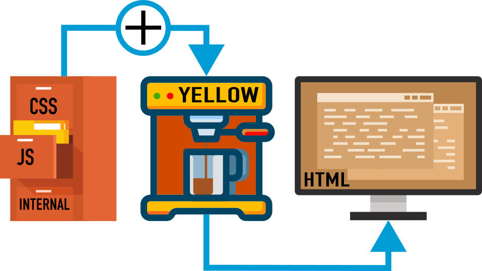

<p align="right"><a href="README.md">English</a> &nbsp; <a href="README-de.md">German</a></p>

# Addtopage

Add CSS, JavaScript files or meta data to [Yellow](https://datenstrom.se/yellow/) web pages.

<p align="center"></p>

## How to install an extension

[Download ZIP file](https://github.com/kgitthoene/yellow-addtopage/archive/refs/heads/main.zip) and copy it file into your `system/extensions` folder. [Learn more about extensions](https://datenstrom.se/yellow/extensions/).

Sample installation instructions:

```
cd system/extensions
wget https://github.com/kgitthoene/yellow-addtopage/archive/refs/heads/main.zip -O yellow-addtopage-main.zip
```

## Why this extension?

[Yellows](https://datenstrom.se/) slogan is: „Use technology with fewer features.“
This is great – and I love it.
But what, if you want to add a touch salt and pepper, to get it a little bit spicier? This is called Yellow extensions … 🍎

The Yellow way to add [JavaScript](https://en.wikipedia.org/wiki/JavaScript) to its pages is to create a `<theme>.js` file inside the themes directory `system/themes`
See: [Customising JavaScript](https://datenstrom.se/yellow/help/how-to-customise-a-theme#customising-javascript)

So far, so good.
Until you don't want this script on all pages.
Or you have multiple scripts with dedicated, meaningful, names.
The same applies to CSS files.

This extension allows JS and CSS files to be specifically loaded into specific pages.
Or just in all of them.
They retain their original names or embed directly into the HTML output.

In addition, page and system information from Yellow can be integrated into the HTML output as JavaScript data structures in order to use it in scripts.
That's the way to let JS look under Yellows hood!

## Inject stuff to web pages

First thing you've to know is the [Yellow Folder Structure](https://datenstrom.se/yellow/help/api-for-developers#folder-structure).
Here you see the part that is important to us.

```
├── content               = content files
├── media                 = media files
│   └── downloads
└── system                = system files
    ├── extensions
    └── themes
```

In `media/downloads` (and of course subdirectories) we'll place all JS and CSS files, we want to load to pages.
Unless you change `CoreDownloadLocation` in the main configuration file `system/extensions/yellow-system.ini`\
Yellows default value for `CoreDownloadLocation` is `/media/downloads`

If you only want to add something to one page, add instructions directly to the page or in the [page settings](https://datenstrom.se/yellow/help/how-to-change-the-system#page-settings).

If you want to add something everywhere, add a theme specific file with instructions to the theme directory.
It's named `system/themes/<theme>.addtopage`, where `<theme>` is the name of the configured theme.\
In Yellows default configuration the theme is `stockholm`, so `<theme>` is `stockholm` and the instructions file is: `system/themes/stockholm.addtopage`

### Instructions to inject stuff

Each instruction has three parts, which are separated by space.
Sorry for this, therefore you can't have directories or files with spaces in their names.

**`Type` `File` `Options`**

<br/>

| `Type` | Meaning |
| --- | --- |
| `JS` | Inject a JavaScript file. |
| `CSS` | Inject a CSS file. |
| `PAGE` | Inject page meta data as JavaScript code. |
| `SYSTEM` | Inject system meta data as JavaScript code. |
| `EXTENSIONS` | Inject meta data about installed extensions as JavaScript code. |

<br/>

**`File`** – Name of a JS or CSS file inside `media/downloads`\
If `File` is `my-mighty-script.js` it should be placed here: `media/downloads/my-mighty-script.js`

For injection of meta data `File` is meaningless.
Don't set it, or if you want to use `Options` set it to `-`

<br/>

| `Options` | Meaning |
| --- | --- |
| `footer` | Inject file or meta data in the footer of the HTML output. If you omit `footer`, the data is injected in the header of the HTML output. |
| `inline` | This is used for meta data. If set with a file, the files content is read and embedded in the HTML output. For meta data you may omit this option. |
| `debug` | Output some debug information as comments to the HTML output. |

### Where to place these instructions?

 **Page:** Add a shortcut with parameters inside the page content.

**Example:** `[addtopage JS my-mighty-script.js footer]`

This adds the script at the footer of the specific page.
If you want to add multiple files or meta data, simply use multiple shortcuts.

 **Page Settings:** Add one or multiple instructions in the [page settings](https://datenstrom.se/yellow/help/how-to-change-the-system#page-settings).
The page setting are at the top of a markdown page.

**Example:**

```
---
Title: Example page
Addtopage: JS my-mighty-script.js footer
---
```

Does the same as the shortcut inside the specific page.

If you want to add multiple files or meta data to the page settings, separate them by `|`

```
---
Title: Example page
Addtopage: CSS my-important-style.css | JS my-mighty-script.js footer
---
```

This adds `my-important-style.css` to the page header and `my-mighty-script.js` to the page footer.

 **Theme:** Add one or multiple instructions to the theme specific file `<theme>.addtopage` in `system/themes`

**Example:**

Content of `system/themes/stockholm.addtopage`, if your Theme is `stockholm`:

```
CSS my-important-style.css
JS my-mighty-script.js footer
```

This adds `my-important-style.css` to the page header and `my-mighty-script.js` to the page footer **<ins>on ervery page Yellow renders!</ins>**

 **Remember!** Page and page settings instructions affect only a specific page. Theme instructions affect the whole site.

### Use injected Meta Data

If you add `[addtopage PAGE]` to your page, the current pages meta data is added to the page header.

Resulting HTML code (example!):


```
<script type="text/javascript">
globalThis[Symbol["for"]('Yellow-Page')] = {
    "title": "Digamma",
    "language": "en",
    "modified": "2025-12-29 23:34:27",
    "sitename": "Digamma",
    "author": "Administrator",
    "layout": "default",
    "theme": "stockholm",
    "parser": "markdown",
    "status": "public",
    "description": "Halle (Westphalia) Art Gallery",
    "image": "site-image.jpg",
    "titlecontent": "Digamma",
    "titlenavigation": "Digamma",
    "titleheader": "Digamma",
    "editpageurl": "http://localhost/edit/"
};
</script>
```

To access this data use the following JavaScript code:

```
const Page = globalThis[Symbol.for('Yellow-Page')];
console.log("Page.title = " + Page.title);
```

## Settings

The following setting can be configured in file `system/extensions/yellow-system.ini`:

`AddToPageDebugMode`: Switch logging off / on. E.g. `0`, `1`

0 = Logging off. 1 = Logging on.

Default: `AddToPageDebugMode: 0`

Log file location: `system/extensions/yellow-website.log`

## Acknowledgements

This extension is inspired by [yellow-gallery](https://github.com/annaesvensson/yellow-gallery) by [Anna Svensson](https://github.com/annaesvensson).\
The example uses: [Darkmode.Js](https://darkmodejs.learn.uno/) and [zepto.js](https://zeptojs.com/).\
Thank you for the good work.

## Developer

[Kai Thoene](https://github.com/kgitthoene)
